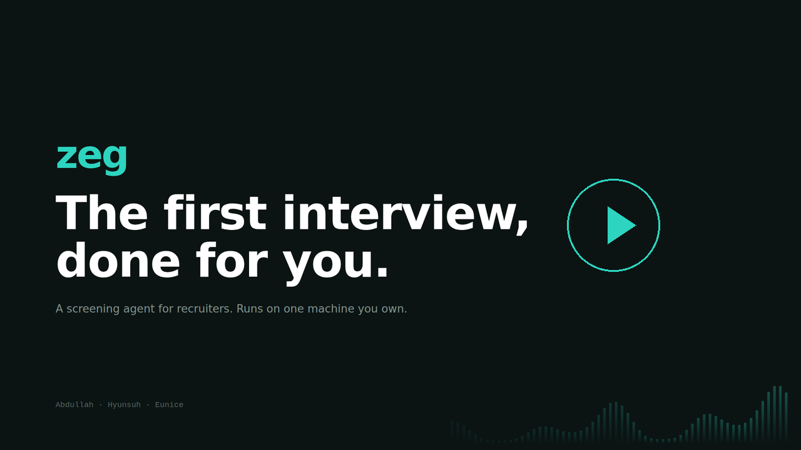
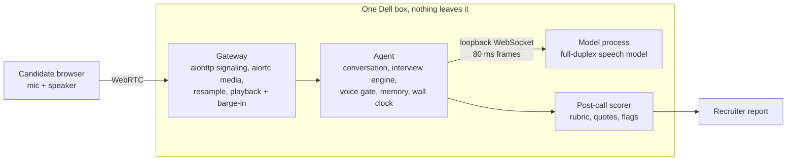

# zeg

**An on-device AI interviewer for software engineering screening calls.** It joins a
call, runs a technical screen, and hands a recruiter a 1-10 assessment with the quotes
that justify it. Candidate audio never leaves the machine.

It gathers evidence and recommends. A human makes the hiring decision.

## Watch the demo, two minutes

[](https://github.com/zero-abd/zeg/blob/main/docs/zeg-demo.mp4)

The problem, a real screening call end to end, and the report it produces.
Plays in the browser: **[docs/zeg-demo.mp4](https://github.com/zero-abd/zeg/blob/main/docs/zeg-demo.mp4)**.

The slides on their own are [`deck.html`](deck.html). Clone and open it, or run
`make deck` to rebuild it from [`tools/build_deck.py`](tools/build_deck.py).

## Why on-device

Everything runs on one Dell box. No third-party processor sees the call, so there is no
data-processing review and no per-interview fee. The reasoning is written up in
[docs/10-why-on-device.md](docs/10-why-on-device.md).

## What it does

- **Runs the interview as a state machine, not a prompt.** The engine owns the time
  budget, which rubric dimensions still lack evidence, and which follow-ups are legal to
  ask. The model phrases questions and weighs answers; it does not decide control flow.
- **Talks full duplex.** Partial and final transcripts, barge-in that cancels queued
  agent audio, and a goodbye before the time limit ends the call.
- **Opens with disclosure and consent.** The agent says it is an AI before anything
  else, and a call without consent does not proceed.
- **Scores after the call.** A separate pass rates each rubric dimension, quotes the
  transcript lines behind every score, says "insufficient evidence" rather than guessing,
  and flags anything a human should weigh.
- **Ships its own evals.** Scorer agreement on labelled transcripts, bias pairs,
  red-team prompts, consent edge cases, speech recognition, and a voice-gate probe, all
  runnable without a GPU.

## Architecture



Everything meets at one contract, [`services/agent/zeg/backends/base.py`](services/agent/zeg/backends/base.py).
[`mock.py`](services/agent/zeg/backends/mock.py) implements it with no model, so the
whole stack above the model can be built and tested on a laptop.
[`gb10.py`](services/agent/zeg/backends/gb10.py) and
[`zeg/runtime/`](services/agent/zeg/runtime) implement it against the real model. The
process split, the wire protocol and the frame clock are in
[docs/11-runtime.md](docs/11-runtime.md).

## Tech stack

| Part | Stack |
| --- | --- |
| Agent (`services/agent`) | Python 3.9+, standard library only; pytest |
| Model runtime (on the box) | PyTorch, torchaudio, Hugging Face Transformers, lhotse; Dell Pro Max with NVIDIA GB10 |
| Gateway (`services/gateway`) | aiortc (WebRTC), aiohttp, PyAV resampling |
| Landing page (`web`) | Next.js 16, React 19, Tailwind CSS 4, Framer Motion |

## Barebone test, on your laptop, right now

No GPU, no model download, no dependencies beyond pytest. This runs a scripted interview
through the mock backend so you can see the shape of a call and work on everything above
the model.

```bash
git clone https://github.com/zero-abd/zeg.git && cd zeg
make setup
make demo
```

You get a timestamped transcript, a summary and the post-call report:

```
[00:00] agent  Hi, thanks for making the time. Before we start, two things you
               should know. I am an AI interviewer, not a person...
[00:18] caller yes that is fine
[00:18] agent  Thanks. Tell me about the hardest bug you shipped a fix for this year.
[00:28] caller a race condition in our payment reconciler
[00:28] agent  What did you personally do there, as opposed to the rest of the team?
...
backend            mock
call duration      64.7 s
agent speech       40.7 s
interruptions      1
reply latency      median 300 ms, p95 300 ms
```

```bash
make test      # agent and gateway test suites, no GPU needed
make evals     # scorer against labelled transcripts
make bias      # also: make redteam, make consent, make asr, make gate
make web       # landing page dev server
```

### What the mock is and is not

It imitates the *shape* of the real model: full duplex, partial then final transcripts,
barge-in, streamed audio at 22.05 kHz. Replies come from a fixed script and the audio is
a 220 Hz tone, not speech.

The clock is virtual. Time advances by the duration of each frame pushed, not by wall
clock, so a 15-minute call replays in under a second and the numbers are identical every
run. That makes it a regression test. **The latency figure is frame accounting, not a
measurement of anything.** Real latency needs the box.

## Real test, on the Dell box

The full pipeline needs the box, the GPU and the weights. Bring-up commands and the
weight download live in `SETUP.local.md`, which is untracked.

Once the speech runtime is up, point zeg at it:

```bash
.venv/bin/python -m zeg.cli --backend gb10
```

To take a call from a browser instead of the terminal:

```bash
make gateway-setup
make gateway BACKEND=gb10     # http://localhost:8080
```

Wear headphones. A speaker and an open mic on the same machine produce a feedback loop
that will eat an hour before anyone works out what is happening.

## Status

Built for a hackathon; see [plan.md](plan.md). The agent, the mock backend, the scorer,
the evals and the gateway's bridge, framing and playback are tested on a laptop. The
model process (`runtime/model.py`) needs CUDA and is not covered by the laptop test
suite; [docs/11-runtime.md](docs/11-runtime.md) keeps an honest tested-versus-untested
table. Google Meet joining and gaze tracking are stretch goals.

## Layout

```
ONBOARDING.md           start here if you are joining
plan.md                 the build plan
Makefile                setup, test, demo, evals, gateway, web, deck
docs/                   design decisions, with the reasoning kept
services/
  agent/                interview brain: conversation, engine, rubric, scoring
    zeg/backends/base.py    the contract everything meets at
    zeg/backends/mock.py    that contract, no GPU needed
    zeg/backends/gb10.py    that contract, against the model process
    zeg/runtime/            the model process: protocol, session, frame loop
    zeg/evals/              bias, red-team, consent, recognition, voice gate
    zeg/conversation.py     how a call is driven
    zeg/prompts.py          greeting, consent, interview prompt
    tests/
  speech/               model serving on the box
  gateway/              WebRTC call joining, audio in and out
web/                    landing page
```

## Team

| Who | Track |
| --- | --- |
| Abdullah (zero-abd) | Plans and artifacts, coordination |
| Hyunsuh (Tpl52-tech) | Model running locally, mic in, speaker out |
| Eunice (egs89-arch) | Call joining, video and audio ingestion |
